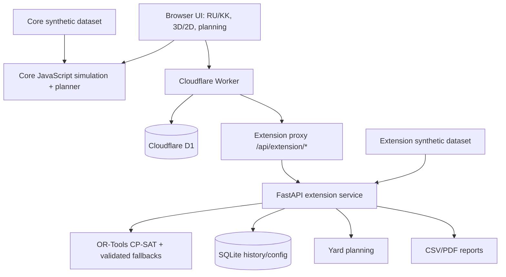

# Jibek Joly

**Система поддержки железнодорожного диспетчерского управления**  
*Теміржол диспетчерлік басқаруын қолдау жүйесі*

🌐 **Frontend Demo:** [Открыть Jibek Joly](https://albina0dali.github.io/Jibek_Joly/)  
💻 **GitHub Repository:** [Исходный код](https://github.com/albina0dali/Jibek_Joly)

> **Демонстрационный прототип.** Все железнодорожные данные в текущей версии синтетические; действия выполняются только в симуляции. GitHub Pages публикует frontend-демо. Полный сценарий с Python-планировщиком, Replay, оптимизацией вагонов и серверными отчётами требует локального запуска или отдельно размещённого backend.
>
> **Демонстрациялық прототип.** Қазіргі нұсқадағы теміржол деректері синтетикалық; барлық әрекет тек симуляцияда орындалады.

## О проекте

**Jibek Joly / «Автодиспетчер»** — hackathon-прототип для мониторинга железнодорожной сети, диспетчерского планирования, моделирования сбоев, автоведения, анализа истории и формирования составов. Диспетчер может сравнить варианты решения, просмотреть предлагаемый план до его применения и оценить результат по рассчитанным показателям.

**Қазақша:** Jibek Joly теміржол диспетчеріне желі жағдайын бақылауға, қозғалысты жоспарлауға, ықтимал шешімдерді салыстыруға және олардың әсерін алдын ала бағалауға көмектеседі.

## Проблема

Железнодорожный диспетчер одновременно учитывает расписание, положение поездов, занятость блок-участков, сигналы, приоритеты, пропускную способность и задержки. Один инцидент может затронуть несколько поездов, а с ростом нагрузки увеличивается число взаимозависимых решений.

Jibek Joly помогает быстрее сравнить допустимые действия и увидеть их последствия, сохраняя окончательное решение за диспетчером.

**Қазақша:** Бір пойыздың кешігуі басқа пойыздарға да әсер етуі мүмкін. Жүйе кестені, учаскелердің бос болуын және басымдықтарды ескеріп, ықтимал шешімдерді салыстыруға көмектеседі.

## Решение

Jibek Joly объединяет в одном интерфейсе:

- состояние сети;
- 3D- и 2D-представление коридора;
- диспетчерские варианты и ресурсные ограничения;
- Preview и Apply;
- индекс движения;
- автоведение;
- Replay и отчёты;
- формирование вагонных составов.

В проекте используются моделирование движения, математическая оптимизация и проверка ресурсных ограничений. **Core** и **Python extension** используют общие идентификаторы станций и общую спецификацию индекса, но сохраняют отдельные наборы поездов, расписания и состояния симуляции.

## Почему Jibek Joly?

**Состояние сети → проблема → варианты решения → Preview → Apply → измеримый результат → Replay / Report**

- **Preview** позволяет оценить предлагаемый план до изменения LIVE-состояния.
- Эффект решения можно сравнить по индексу движения, задержкам и ресурсным показателям.
- Мониторинг, планирование, автоведение, история и работа с составами доступны в одном продукте.

## Основные возможности

| Раздел | Возможности |
|---|---|
| **Оперативная карта** | 3D- и 2D-режимы, поезда, станции, блоки, занятость, сигналы и инциденты |
| **Диспетчерская** | Прогнозы движения, анализ конфликтов и сравнение вариантов |
| **План движения** | Исходный, действующий и предлагаемый планы; Preview, Apply, фильтры и инспектор поезда |
| **Автоведение** | Фактическая и рекомендуемая скорость, ограничения, ETA, профиль скорости и расчётная энергоэффективность |
| **Вагоны и составы** | 120 синтетических вагонов, 4 пути, 2 маневровых локомотива, формирование и оптимизация |
| **История и отчёты** | Снимки состояния, Replay, журнал действий, возврат в LIVE, CSV/PDF |
| **Аналитика** | Индекс движения, задержки, ресурсные конфликты и сравнение сценариев |

Интерфейс доступен на русском и казахском языках, в светлой и тёмной темах.

## Оперативная карта: 3D + 2D

### 3D Обзор сети / 3D Желі көрінісі

Обзор девятистанционного коридора с выбором поездов, станций, блоков и сигналов, управлением камерой и следованием за поездом.

### 2D Диспетчерская схема / 2D Диспетчерлік схема

Схематическое представление основных и резервных путей, занятости блоков, положения и направления поездов, ограничений, инцидентов и сигналов.

Оба режима находятся внутри **«Оперативная карта / Операциялық карта»** (`#map`) и используют одно Core-состояние, часы симуляции, текущий выбор объектов и индекс движения.

## Индекс движения

Индекс движения объединяет пять факторов:

| Фактор | Вес |
|---|---:|
| Соблюдение расписания | 30% |
| Использование пропускной способности | 20% |
| Энергоэффективность | 20% |
| Ресурсные конфликты | 20% |
| Точность прибытия | 10% |

Формула:

`Q = Σ(score_i × weight_i / 100)`

Пример синтетического сценария:

**91.1 → 74.0 → 91.1**  
*Normal → Incident → Recovery*

Значения рассчитываются из состояния симуляции, а не назначаются кнопками.

## Модель состояния: LIVE / PREVIEW / REPLAY

| Режим | Значение |
|---|---|
| **LIVE** | Текущее состояние симуляции |
| **PREVIEW** | Просмотр предлагаемого плана без изменения LIVE |
| **REPLAY** | Просмотр сохранённого исторического снимка без изменения LIVE |

**Apply** — отдельное действие: оно проверяет актуальность плана и изменяет действующее расписание внутри соответствующей симуляционной модели.

## Как посмотреть демо

🌐 [Открыть Frontend Demo](https://albina0dali.github.io/Jibek_Joly/)

> GitHub Pages показывает frontend. Для полного сценария ниже требуется локальный запуск с Python backend.

1. Откройте **«Оперативная карта»** (`#map`).
2. Переключитесь между **«3D Обзор сети»** и **«2D Диспетчерская схема»**.
3. Перейдите в **«План движения»** (`#movement-plan`) и нажмите **«Сбросить демо»**.
4. Запустите **«Демо-сбой: F103 +10 мин»**.
5. Дождитесь расчёта альтернативных вариантов.
6. Выберите вариант и откройте **Preview** — LIVE-состояние при этом не меняется.
7. Нажмите **«Применить в симуляторе»** и проверьте изменение плана и индекса.
8. Откройте **«История и отчёты»**, используйте Replay и скачайте CSV/PDF.
9. В **«Вагоны и составы»** выполните оптимизацию формирования и сравните результат до/после.
10. Откройте **«Автоведение»** для рекомендаций скорости или вернитесь в **«Оперативную карту»**.

> F103 относится к Python-модели. Её Preview/Replay не проецируются автоматически на Core-карту; Core и Python пока сохраняют отдельные состояния.

## Вагоны и составы: Before / After

Пример воспроизводимого синтетического demo-run на фиксированном seed:

| Метрика | До | После |
|---|---:|---:|
| Составы | 12 | 8 |
| Ожидание вагонов, вагоно-часы | 120.48 | 114.48 |
| Просроченное время, вагоно-минуты | 997 | 692 |
| Среднее заполнение состава | 33.3% | 53.7% |

Это результаты модели, а не измеренная экономия на реальной железной дороге. Глобальная оптимальность решения не заявляется.

## Архитектура



Cloudflare Worker не выполняет Python или OR-Tools. Для полного размещения требуется отдельно запущенный FastAPI-сервис и настройка `EXTENSION_URL`.

## Технологический стек

| Слой | Технологии |
|---|---|
| Core frontend | JavaScript ES modules, HTML/CSS, Three.js, SVG |
| Extension frontend | React, TypeScript/TSX |
| Core backend | Cloudflare Worker; Miniflare локально |
| Core persistence | Cloudflare D1, Drizzle, SQL migrations |
| Extension backend | Python 3.12, FastAPI, Uvicorn |
| Optimization | OR-Tools CP-SAT + проверенные резервные алгоритмы |
| Extension history | SQLite |
| Reports | ReportLab, CSV, pdf-lib/fontkit |
| Build | Node.js, npm, esbuild |
| Testing | Node test runner, Worker/D1 integration, pytest, Playwright |

## Демонстрационные данные

Все текущие железнодорожные данные являются синтетическими.

| Набор | Состав |
|---|---|
| Canonical network | 9 станций |
| Core corridor | 9 станций, 6 SIM-поездов |
| Python extension | 8 канонических станций, 16 поездов, 14 блоков |
| Yard | 120 вагонов, 4 пути, 2 маневровых локомотива |

**Каноническая сеть:**  
Көкшетау → Бурабай → Ақкөл → Астана → Қарағанды → Мойынты → Шу → Алматы-1 → Алматы-2

Extension использует восемь из девяти канонических станций. Его условная длина коридора **164 км** является масштабом синтетической модели, а не заявлением о реальной географии.

## Структура проекта

```text
web/                 Интерфейс, Core, 3D/2D и React-страницы
server/              Cloudflare Worker, Core API и extension proxy
server/extension/    FastAPI, планировщик, yard и отчёты
data/                Синтетические Core/extension datasets
db/                  SQL-схема
drizzle/             D1 migrations/schema tooling
scripts/             Сборка, локальный запуск и data tooling
tests/               JavaScript, Worker/D1, Python и browser tests
docs/                Формула индекса, карта, интеграция и acceptance reviews
```

## Локальный запуск

Проверенное окружение:

- **Node.js 24**
- **Python 3.12**

### Windows / PowerShell

```powershell
npm ci
py -3.12 -m venv .jol-local/extension-venv
.jol-local\extension-venv\Scripts\python.exe -m pip install -r server/extension/requirements.lock.txt
npm start
```

После запуска откройте:

**http://localhost:8787/#map**

Core запускается локально на `8787`, Python extension — на `8001`.

> Для последующих запусков, если зависимости уже установлены, достаточно `npm start`.

## Тестирование

Основные проверки проекта:

```bash
npm run build
npm run check
npm test
npm run test:extension
```

Для browser-проверок при запущенном локальном приложении:

```bash
npx playwright install chromium
npm run test:map
npm run test:browser
npm run test:ui
```

Браузерные тесты изменяют локальное синтетическое demo-состояние и могут создавать review-артефакты.

## API

| Маршрут | Назначение |
|---|---|
| `GET /api/openapi.json` | Описание API |
| `GET /api/health` | Проверка Core-хранилища |
| `GET /api/stream` | Симулированная SSE-телеметрия |
| `GET /eco/package`, `POST /eco/advice` | Данные и рекомендации автоведения |
| `GET /api/extension/state`, `GET /api/extension/history` | Операционное состояние и история |
| `POST /api/extension/incidents`, `POST /api/extension/replan` | Инциденты и альтернативные планы |
| `POST /api/extension/replan/{id}/apply` | Применение проверенного плана |
| `GET /api/extension/reports/{format}` | CSV/PDF-отчёты |
| `/api/extension/resources/yard/*` | Yard-оптимизация и Apply |

При локальном запуске интерактивная документация Python доступна на:

**http://localhost:8001/docs**

## Соответствие кейсу хакатона

| Требование | Реализация | Статус |
|---|---|---|
| Realtime | Симулированный SSE 1 Гц; Python использует extension API | Демо |
| Автодиспетчеризация | Ресурсные ограничения, приоритеты, альтернативы и проверка Apply | В рамках модели |
| Автоведение | Скорость, ограничения, ETA и расчётная энергоэффективность | Консультативное демо |
| Индекс движения | Единая формула из пяти факторов | Реализовано |
| Replanning | Incident → Preview → Apply → пересчёт результата | Python-модель |
| Карта / поездограмма | 3D/2D Core и операционная визуализация Python | Раздельные состояния |
| Replay | Исторические снимки без изменения LIVE | Реализовано |
| CSV/PDF | Скачивание отчётов по текущему LIVE | Реализовано в текущем объёме |

## Безопасность и область применения

Jibek Joly — прототип моделирования и поддержки решений. Он **не заменяет**:

- СЦБ;
- interlocking;
- АЛСН / АЛС-ЕН;
- сертифицированные системы безопасности движения;
- решения уполномоченного железнодорожного персонала.

Все действия **Apply** относятся только к симуляции.

**Қазақша:** Jibek Joly шешім қабылдауды қолдауға және модельдеуге арналған. Ол теміржолдың сертификатталған қауіпсіздік жүйелерін немесе уәкілетті мамандардың шешімдерін алмастырмайды. Барлық әрекет тек симуляцияда орындалады.

## Ограничения

- Данные синтетические; интеграция с действующими системами КТЖ отсутствует.
- Core и Python пока сохраняют отдельные состояния; сквозное восстановление Core-карты после Python Apply не реализовано.
- GitHub Pages публикует frontend-демо, а не полный backend.
- Целевые показатели `<500 мс` для UI и `≤5 с` для полного replanning пока не подтверждены измерениями.
- Модели движения и энергии упрощены; система не является safety-certified или production-ready.

## Дальнейшее развитие

Следующие логичные этапы:

- объединение Core и Python в единое состояние;
- интеграция с согласованными реальными операционными данными;
- измерение latency и нагрузочное тестирование;
- расширение оптимизации ресурсов;
- production deployment, security hardening и эксплуатационный мониторинг.

## Документация

- [Индекс движения](docs/MOVEMENT_INDEX.md)
- [Канонические станции](docs/STATION_MAPPING.md)
- [Оперативная карта](docs/OPERATIONS_MAP.md)
- [Аудит требований кейса](docs/CASE_ACCEPTANCE_AUDIT.md)
- [Финальная проверка UI/UX](docs/FINAL_UI_UX_REVIEW.md)
- [Объединение модулей и сценарий демо](docs/UNIFICATION_REVIEW.md)

---

🌐 **Frontend Demo:** [Открыть Jibek Joly](https://albina0dali.github.io/Jibek_Joly/)  
💻 **GitHub Repository:** [Исходный код](https://github.com/albina0dali/Jibek_Joly)
